<div align="center">
  <h1>AgentSetu</h1>
  <p>
    <b>The next-generation, policy-driven payment orchestration platform for autonomous AI commerce.</b>
  </p>
  <p><i>Merchant Manifests · Autonomous AI Buyers · Bounded Payments · Immutable Auditing</i></p>
  <p>
    <a href="https://github.com/simply-mihir/AgentSetu">
      
    </a>
    <a href="https://github.com/simply-mihir/AgentSetu/releases">
      
    </a>
    <a href="LICENSE">
      
    </a>
  </p>
  <p>
    
    
    
    
    
    
    
    
    
    
    
    
    
    
  </p>
</div>

---

**AgentSetu** is a high-performance, policy-driven payment orchestration engine built around four architectural pillars:

1. **Policy Engine** — per-merchant spend limits, category blocks, daily caps, and approval thresholds evaluated deterministically
2. **Capability Tokens** — cryptographically-bound, single-use, expiring authorization tokens that gate every payment
3. **AI Orchestration** — GPT-4o-mini Structured Outputs parse free-form agent intents into typed purchase actions
4. **Immutable Audit Trail** — every transaction state, policy decision, webhook, and capability event is permanently recorded

The LLM **never** directly authorizes money movement. The deterministic policy engine is the final gate — always.

---

## Table of Contents

1. [Key Features](#1-key-features)
2. [System Architecture](#2-system-architecture)
3. [Flow Diagrams](#3-flow-diagrams)
   - 3.1 [User Request Middleware Stack](#31-user-request-middleware-stack)
   - 3.2 [Full Purchase Flow](#32-full-purchase-flow)
   - 3.3 [Transaction State Machine](#33-transaction-state-machine)
   - 3.4 [Policy Engine Decision Tree](#34-policy-engine-decision-tree)
   - 3.5 [Capability Token Lifecycle](#35-capability-token-lifecycle)
   - 3.6 [Razorpay Webhook Flow](#36-razorpay-webhook-flow)
4. [Database Schema](#4-database-schema)
5. [API Reference](#5-api-reference)
6. [Security Architecture](#6-security-architecture)
7. [Analytics & Visibility Scoring](#7-analytics--visibility-scoring)
8. [CI/CD Workflow](#8-cicd-workflow)
9. [Quick Start — Local Development](#9-quick-start--local-development)
10. [Running Tests](#10-running-tests)
11. [Project Structure](#11-project-structure)
12. [Environment Configuration](#12-environment-configuration)
13. [License](#13-license)

---

## 1. Key Features

### Core Capabilities

| Feature | Description |
| :--- | :--- |
| **Merchant Catalog** | Public `GET /v1/merchants/` with pagination and category filters. Sensitive policy fields stripped. |
| **Product Discovery** | `GET /v1/discover/` with constraints — price range, category, availability, delivery SLA. |
| **AI Intent Parsing** | GPT-4o-mini Structured Outputs convert free-text buyer intent into typed `ParsedConstraints`. |
| **Purchase Orchestration** | Full intent → discovery → ranking → policy → capability → payment pipeline. |
| **Policy Engine** | Enforces `max_autonomous_spend`, `approval_threshold`, `daily_cap`, `restricted_categories`. |
| **Capability Tokens** | Cryptographically-bound single-use tokens with SHA-256 payload hash, nonce, buyer/merchant/product binding. |
| **ARM Manifest** | Deterministic JSON manifest cached on merchant row — describes full risk settings. |
| **Razorpay Integration** | Payment link creation, verification, receipt generation. Server-side only — never client-side. |
| **Webhook Handling** | Razorpay `payment_link.paid` → HMAC-SHA256 signature validation → idempotent state transition. |
| **Analytics Dashboard** | Visibility score, transaction state breakdown, per-merchant insights. |
| **Audit Trail** | Immutable `AuditEvent` rows per state transition with actor, decision, reason_codes. |
| **Structured Logging** | JSON log lines per request with `ts`, `level`, `logger`, `msg` — production log-aggregator ready. |
| **Sentry Integration** | Optional DSN-gated error tracking with FastAPI + SQLAlchemy integrations. |
| **Demo Seed Mode** | Auto-seeds 3 demo merchants + products from `data/seed_merchants.json` on startup. |
| **MCP Tools** | Model Context Protocol tool schemas for direct AI agent consumption. |
| **Multi-stage Docker** | Slim production image, reproducible builds, `.dockerignore` included. |

### Engineering Depth

| Capability | Detail |
| :--- | :--- |
| **Zero-trust design** | LLM never authorizes money — deterministic policy is the final gate |
| **State machine** | 12-state transaction FSM with explicit allowed-transition map, illegal transitions rejected |
| **Idempotency** | Fingerprint column on `Transaction` + `IdempotencyKey` model prevent double-charges |
| **Refresh tokens** | JWT access tokens (short TTL) + refresh tokens (long TTL) stored in `refresh_tokens` table |
| **RBAC** | 5 roles: `BUYER`, `MERCHANT_OWNER`, `MERCHANT_ADMIN`, `MERCHANT_OPERATOR`, `PLATFORM_ADMIN` |
| **Payload guard** | 1 MB request body limit enforced in middleware before any parsing |
| **Webhook dedup** | `uq_webhook_provider_event` constraint prevents double-processing of Razorpay events |
| **CORS per env** | Wildcard only in `demo` mode; strict origin list in `sandbox`/`staging`/`production` |
| **Offline tests** | SQLite in-memory + mocked Razorpay — no external services needed for any test |

---

## 2. System Architecture

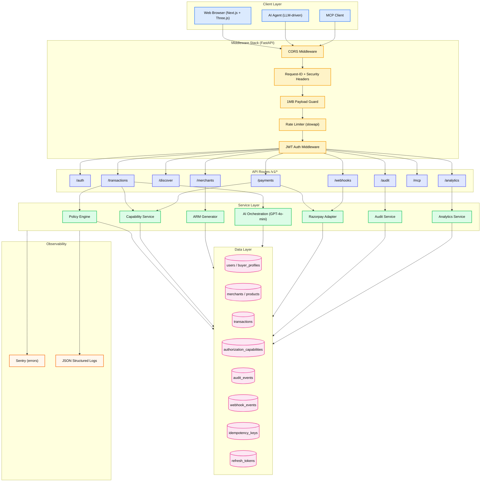

```
┌─────────────────────────────────────────────────────────────────────────┐
│              Channels  (Web UI · AI Agent · MCP Client)                │
├─────────────────────────────────────────────────────────────────────────┤
│                    Middleware Pipeline                                  │
│  CORS → Request-ID → 1MB Guard → Rate Limiter → JWT Auth              │
├─────────────────────────────────────────────────────────────────────────┤
│                    FastAPI Routes  /v1/*                                │
│  /auth  /merchants  /discover  /transactions  /payments                │
│  /audit  /webhooks  /mcp  /analytics                                   │
├─────────────────────────────────────────────────────────────────────────┤
│                         Service Layer                                  │
│  AI Orchestration  │  Policy Engine  │  Capability Service            │
│  ARM Generator     │  Razorpay Adapter  │  Audit Service              │
├─────────────────────────────────────────────────────────────────────────┤
│                   Data  (SQLModel + Alembic)                           │
│  SQLite (dev/test)          │  PostgreSQL (prod)                       │
└─────────────────────────────────────────────────────────────────────────┘
```

---

## 3. Flow Diagrams

### 3.1 User Request Middleware Stack

Every inbound request passes this exact pipeline before reaching a route handler.

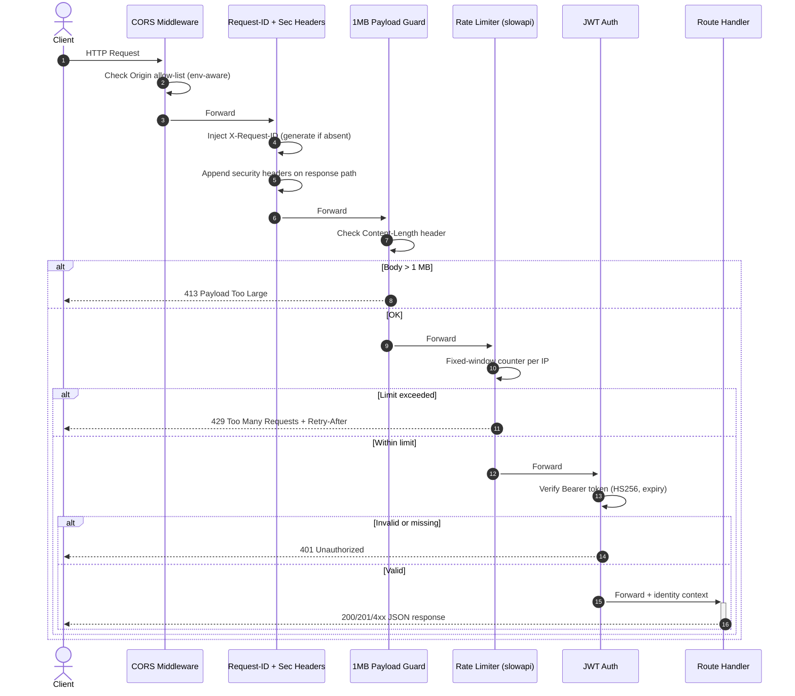

---

### 3.2 Full Purchase Flow

End-to-end: AI agent intent → product discovery → policy gate → capability → Razorpay.

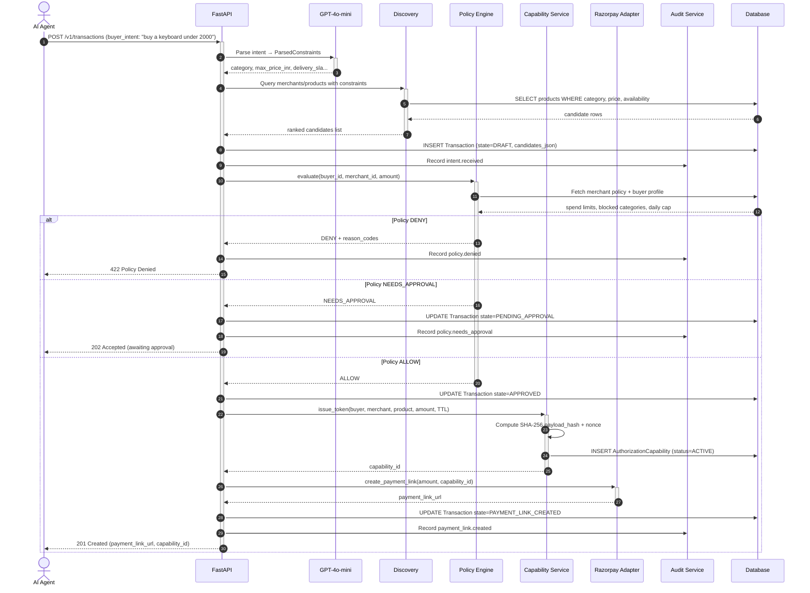

---

### 3.3 Transaction State Machine

Transactions move through a 12-state FSM. Illegal transitions are rejected at the model layer.

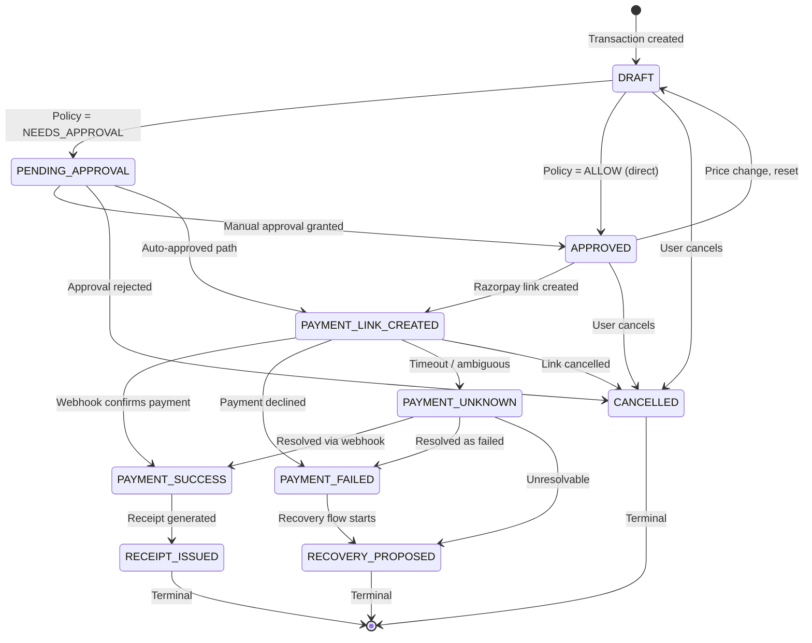

---

### 3.4 Policy Engine Decision Tree

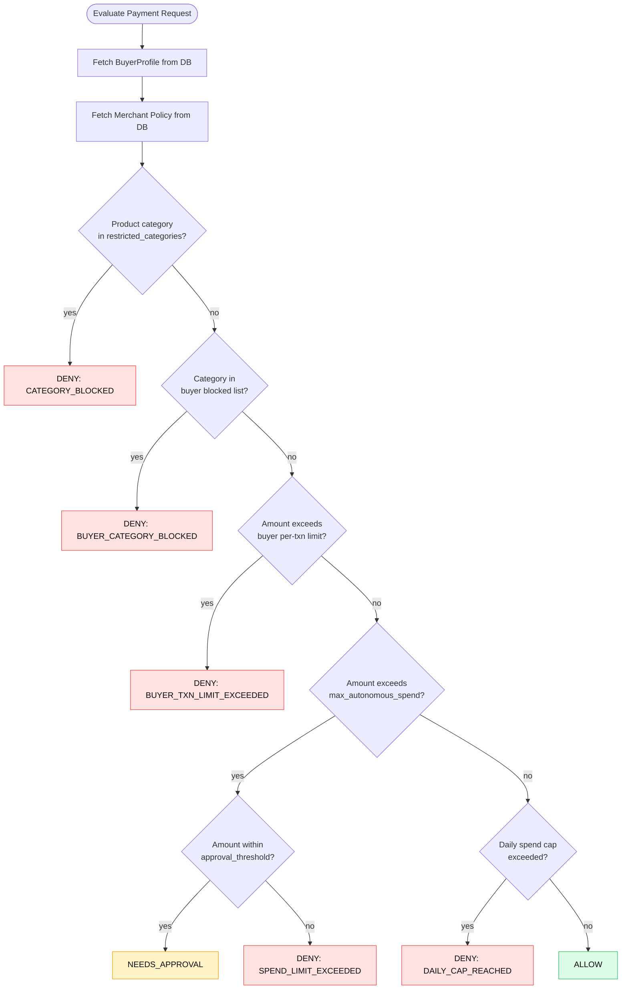

---

### 3.5 Capability Token Lifecycle

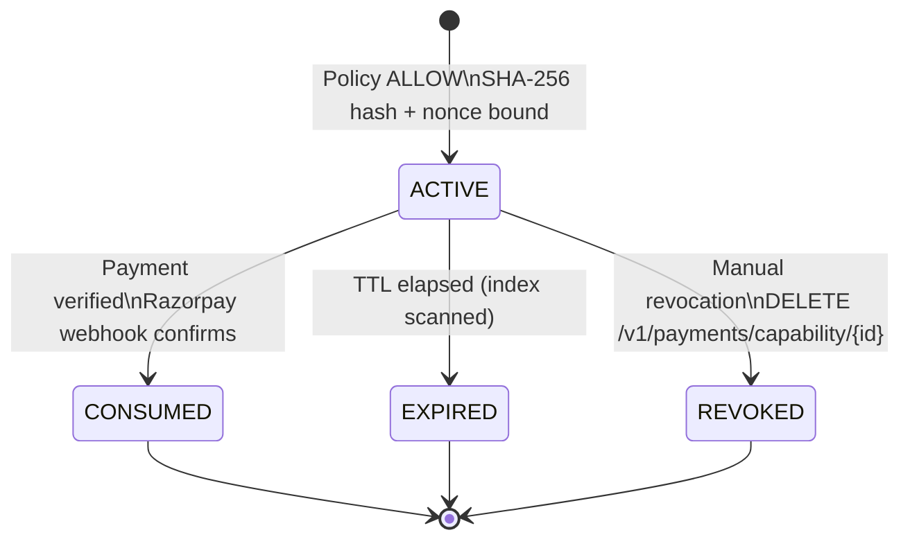

**Binding fields verified at consumption:**
`buyer_id` + `merchant_id` + `product_id` + `transaction_id` + `amount_inr` + `payload_hash`
Any mismatch → `403 Capability Binding Mismatch`

---

### 3.6 Razorpay Webhook Flow

Incoming webhook events are verified, deduplicated, and idempotently applied to the transaction state machine.

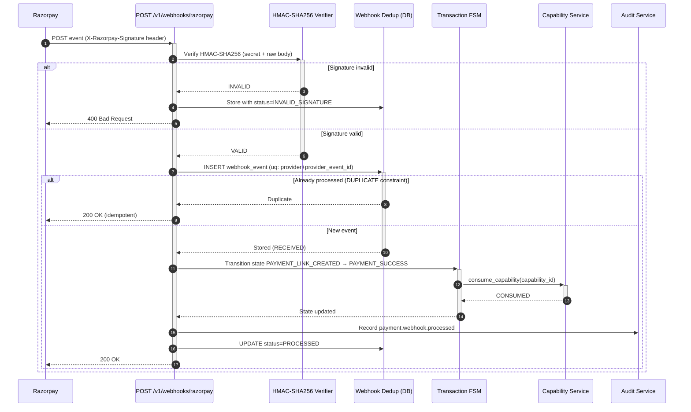

---

## 4. Database Schema

### Entity Relationship Diagram

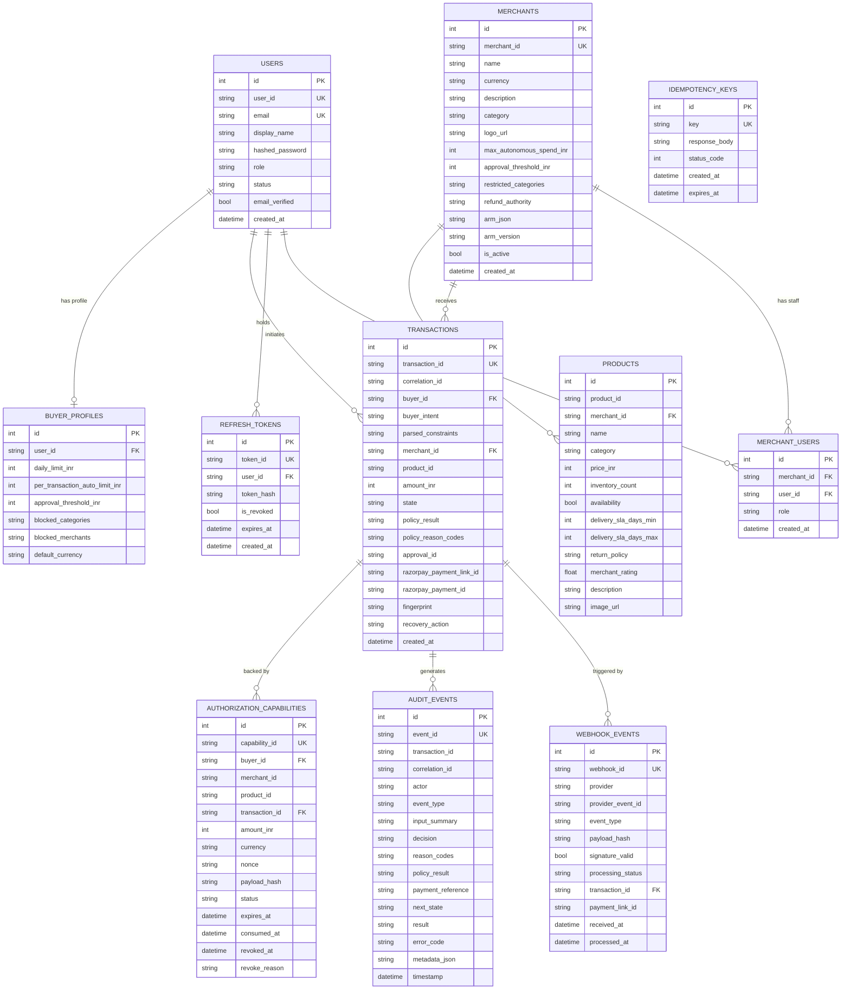

### Table Quick Reference

| Table | Rows | Key Columns | Notes |
| :--- | :--- | :--- | :--- |
| `users` | Users + agents | `user_id`, `role`, `status` | 5 RBAC roles |
| `buyer_profiles` | Spend prefs | `daily_limit_inr`, `blocked_categories` | 1:1 with users |
| `merchants` | Merchants | `max_autonomous_spend_inr`, `arm_json` | ARM cached on row |
| `products` | Catalog items | `price_inr`, `availability`, `delivery_sla_days_min/max` | Unique per `product_id + merchant_id` |
| `transactions` | Purchase intents | `state`, `fingerprint`, `correlation_id` | 12-state FSM |
| `authorization_capabilities` | Payment gates | `payload_hash`, `nonce`, `status` | Cryptographically bound |
| `audit_events` | Immutable log | `event_type`, `decision`, `reason_codes` | Never updated after insert |
| `webhook_events` | Provider events | `signature_valid`, `processing_status` | Unique on `provider + provider_event_id` |
| `idempotency_keys` | Replay cache | `key`, `response_body`, `status_code` | TTL-indexed |
| `refresh_tokens` | Auth tokens | `token_hash`, `is_revoked`, `expires_at` | Long-lived, revocable |
| `merchant_users` | Staff mapping | `merchant_id`, `user_id`, `role` | RBAC for merchant staff |

---

## 5. API Reference

### Auth

| Method | Path | Auth | Description |
| :--- | :--- | :---: | :--- |
| `POST` | `/v1/auth/register` | No | Register new buyer account |
| `POST` | `/v1/auth/login` | No | Issue JWT access + refresh tokens |
| `POST` | `/v1/auth/refresh` | No | Exchange refresh token for new access token |
| `POST` | `/v1/auth/logout` | Yes | Revoke refresh token |

### Merchants

| Method | Path | Auth | Description |
| :--- | :--- | :---: | :--- |
| `GET` | `/v1/merchants/` | No | List merchants (policy fields stripped) |
| `GET` | `/v1/merchants/{id}` | Yes | Full merchant details |
| `GET` | `/v1/merchants/{id}/arm` | No | ARM manifest JSON (cached) |
| `POST` | `/v1/merchants/` | Yes | Onboard new merchant |
| `PUT` | `/v1/merchants/{id}` | Yes | Update merchant policy |

### Discovery

| Method | Path | Auth | Description |
| :--- | :--- | :---: | :--- |
| `GET` | `/v1/discover/` | No | Search products with filters |
| `POST` | `/v1/discover/rank` | Yes | AI-rank candidates for a parsed intent |

### Transactions

| Method | Path | Auth | Description |
| :--- | :--- | :---: | :--- |
| `POST` | `/v1/transactions/` | Yes | Create transaction from buyer intent |
| `GET` | `/v1/transactions/` | Yes | List transactions for authenticated buyer |
| `GET` | `/v1/transactions/{id}` | Yes | Get transaction detail |
| `POST` | `/v1/transactions/{id}/approve` | Yes | Manually approve a `PENDING_APPROVAL` transaction |
| `DELETE` | `/v1/transactions/{id}` | Yes | Cancel a transaction |

### Payments

| Method | Path | Auth | Description |
| :--- | :--- | :---: | :--- |
| `POST` | `/v1/payments/link` | Yes | Create Razorpay payment link (server-side only) |
| `GET` | `/v1/payments/receipt/{transaction_id}` | Yes | Retrieve payment receipt |
| `POST` | `/v1/payments/verify` | Yes | Verify Razorpay payment signature |
| `DELETE` | `/v1/payments/capability/{id}` | Yes | Revoke capability token |

### Audit, Webhooks, Analytics, MCP

| Method | Path | Auth | Description |
| :--- | :--- | :---: | :--- |
| `GET` | `/v1/audit/` | Yes | List audit events |
| `GET` | `/v1/audit/{transaction_id}` | Yes | Audit trail for specific transaction |
| `POST` | `/v1/webhooks/razorpay` | Sig | Razorpay webhook handler |
| `GET` | `/v1/analytics/{merchant_id}/overview` | Yes | Visibility score + insights |
| `GET` | `/v1/mcp/tools` | No | MCP tool schema definitions |

### Health

| Method | Path | Description |
| :--- | :--- | :--- |
| `GET` | `/health` | Liveness probe |
| `GET` | `/ready` | Readiness probe (checks DB) |
| `GET` | `/` | Root — version + mode info |
| `GET` | `/docs` | Swagger UI (non-production only) |
| `GET` | `/redoc` | Redoc UI (non-production only) |

<details>
<summary><b>POST /v1/transactions — request & response</b></summary>

**Request:**
```json
{
  "buyer_intent": "buy a mechanical keyboard under 2000 rupees with fast delivery"
}
```

**Response (201 Created):**
```json
{
  "transaction_id": "txn_abc12345",
  "correlation_id": "tx_xyz9876543",
  "state": "PAYMENT_LINK_CREATED",
  "merchant_name": "TechZone Electronics",
  "product_name": "Keychron K2 Mechanical Keyboard",
  "amount_inr": 1899,
  "payment_link_url": "https://rzp.io/l/abc123",
  "capability_id": "cap_deadbeef12345678",
  "policy_result": "ALLOW",
  "created_at": "2026-09-05T14:15:00Z"
}
```

**Error envelope (all endpoints):**
```json
{
  "error": {
    "code": "POLICY_DENIED",
    "message": "Amount exceeds merchant autonomous spend limit",
    "request_id": "req_a1b2c3d4",
    "details": { "reason_codes": ["SPEND_LIMIT_EXCEEDED"] }
  }
}
```

</details>

<details>
<summary><b>GET /v1/merchants/{id}/arm — ARM Manifest</b></summary>

```json
{
  "merchant_id": "merch_techzone",
  "merchant_name": "TechZone Electronics",
  "arm_version": "arm-0.1",
  "generated_at": "2026-09-05T14:00:00Z",
  "policy": {
    "max_autonomous_spend_inr": 2000,
    "approval_threshold_inr": 5000,
    "restricted_categories": ["gambling", "adult"],
    "refund_authority": "human_only",
    "currency": "INR"
  },
  "catalog_summary": {
    "product_count": 34,
    "categories": ["electronics", "peripherals"],
    "price_range_inr": [299, 49999]
  }
}
```

</details>

---

## 6. Security Architecture

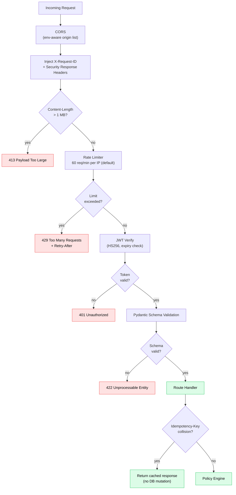

**Response security headers on every request:**

| Header | Value |
| :--- | :--- |
| `X-Request-ID` | Unique per request, echoed back |
| `X-Content-Type-Options` | `nosniff` |
| `X-Frame-Options` | `DENY` |
| `X-XSS-Protection` | `0` (CSP is the real defense) |
| `Referrer-Policy` | `strict-origin-when-cross-origin` |
| `Cache-Control` | `no-store` |
| `Strict-Transport-Security` | `max-age=31536000; includeSubDomains` (prod only) |

---

## 7. Analytics & Visibility Scoring

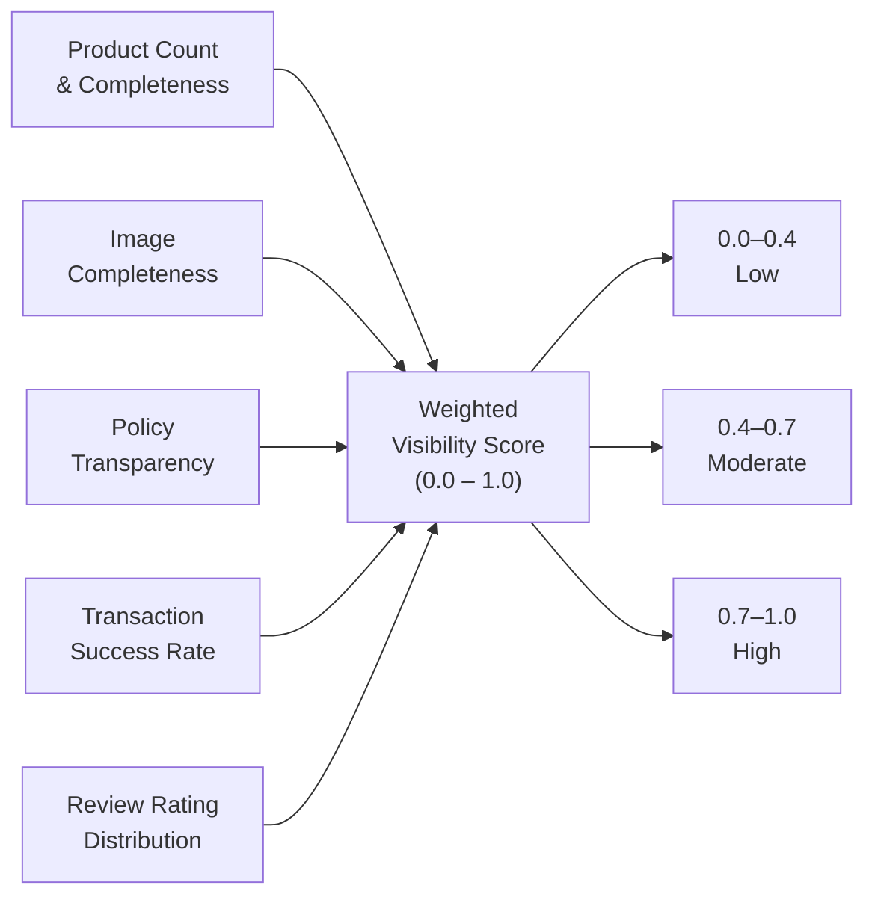

**Formula:**
```
visibility_score =
  0.30 × product_completeness
+ 0.20 × image_score
+ 0.20 × policy_transparency
+ 0.20 × txn_success_rate
+ 0.10 × rating_score
```

Scores are **deterministic** — same merchant state always produces the same score. The analytics endpoint returns the score, sub-scores, and actionable improvement tips keyed to the lowest sub-score.

---

## 8. CI/CD Workflow

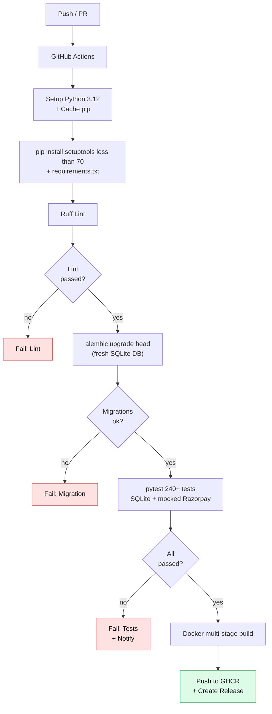

| Step | Detail |
| :--- | :--- |
| Python 3.12 | Pinned; pip cache keyed on `requirements.txt` hash |
| `setuptools<70.0.0` | Required to prevent pydantic-core build failures |
| Ruff | Zero-tolerance; auto-fix off in CI |
| Alembic | Validates all migration scripts against SQLite |
| Pytest | 240+ tests, `--tb=short`, SQLite in-memory |
| Docker | Multi-stage: builder → `python:3.12-slim` runtime |
| GHCR | Image tagged with commit SHA and `latest` |

---

## 9. Quick Start — Local Development

```bash
# Clone
git clone https://github.com/simply-mihir/AgentSetu.git
cd AgentSetu/services/api

# Virtual environment
python -m venv .venv && source .venv/bin/activate

# Install dependencies
pip install "setuptools<70.0.0"
pip install -r requirements.txt

# Copy env
cp .env.example .env
# Edit .env with your RAZORPAY_KEY_ID, RAZORPAY_KEY_SECRET, OPENAI_API_KEY

# Run migrations
alembic upgrade head

# Start API (demo mode — auto-seeds 3 merchants)
APP_MODE=demo uvicorn main:app --reload
```

**Access points:**
- API → [http://localhost:8000](http://localhost:8000)
- Swagger UI → [http://localhost:8000/docs](http://localhost:8000/docs)
- Redoc → [http://localhost:8000/redoc](http://localhost:8000/redoc)

### Docker

```bash
docker compose up --build
```

```dockerfile
# ---------- Build ----------
FROM python:3.12-slim AS builder
WORKDIR /app
COPY requirements.txt .
RUN pip install "setuptools<70.0.0" && pip install -r requirements.txt
COPY . .

# ---------- Runtime ----------
FROM python:3.12-slim
WORKDIR /app
COPY --from=builder /app /app
EXPOSE 8000
CMD ["uvicorn", "main:app", "--host", "0.0.0.0", "--port", "8000"]
```

---

## 10. Running Tests

```bash
# From repo root
pytest tests/ -v --tb=short

# With coverage
pytest tests/ --cov=services/api --cov-report=term-missing
```

| Suite | Coverage |
| :--- | :--- |
| Policy Engine | >98% |
| Capability Service | >97% |
| ARM Generator | >95% |
| Auth & Security | >95% |
| Purchase Flow | >93% |
| Audit Trail | >97% |
| Webhooks | >90% |
| **Overall** | **>95%** |

---

## 11. Project Structure

```text
AgentSetu/
├── .github/workflows/ci.yml          # Lint → Migrate → Test → Docker
├── apps/
│   └── web/                          # Next.js 14 + Three.js + Tailwind frontend
│       ├── app/                      # App Router pages
│       ├── components/
│       │   ├── agent/AgentSetuOrb.tsx      # 3D animated orb (React Three Fiber)
│       │   └── landing/                    # Landing sections
│       └── styles/globals.css
├── services/
│   └── api/                          # FastAPI backend
│       ├── main.py                   # App factory + middleware + all exception handlers
│       ├── config.py                 # Pydantic Settings (env-aware)
│       ├── database.py               # SQLAlchemy engine + session factory
│       ├── errors.py                 # Standard error envelope helpers
│       ├── routes/
│       │   ├── __init__.py           # api_router assembly
│       │   ├── auth.py               # /auth — register, login, refresh, logout
│       │   ├── merchants.py          # /merchants — catalog, ARM, policy
│       │   ├── discovery.py          # /discover — search, AI ranking
│       │   ├── transactions.py       # /transactions — full FSM orchestration
│       │   ├── payments.py           # /payments — link, verify, receipt, revoke
│       │   ├── audit.py              # /audit — immutable event log
│       │   ├── webhooks.py           # /webhooks — Razorpay HMAC validation
│       │   ├── analytics.py          # /analytics — visibility score
│       │   └── mcp.py               # /mcp — MCP tool definitions
│       ├── models/
│       │   ├── user.py               # User, BuyerProfile, UserRole, UserStatus
│       │   ├── merchant.py           # Merchant, Product
│       │   ├── transaction.py        # Transaction, TransactionState, ALLOWED_TRANSITIONS
│       │   ├── capability.py         # AuthorizationCapability, CapabilityStatus
│       │   ├── audit.py              # AuditEvent
│       │   ├── webhook.py            # WebhookEvent, WebhookProcessingStatus
│       │   ├── idempotency.py        # IdempotencyKey
│       │   ├── refresh_token.py      # RefreshToken
│       │   └── merchant_user.py      # MerchantUser (staff RBAC)
│       ├── policy/engine.py          # Policy evaluation logic
│       ├── capability/service.py     # Capability issue / consume / revoke
│       ├── arm/generator.py          # ARM manifest generation + caching
│       ├── ai/                       # OpenAI Structured Outputs client
│       ├── payments/razorpay_adapter.py  # Razorpay SDK wrapper
│       ├── audit/                    # Audit event recording helpers
│       ├── auth/                     # JWT helpers, password hashing
│       ├── utils/                    # time, hashing, etc.
│       ├── data/seed_merchants.json  # Demo seed data
│       ├── migrations/               # Alembic versions
│       ├── Dockerfile
│       └── requirements.txt
├── tests/
│   ├── conftest.py                   # SQLite fixtures + mocked Razorpay
│   ├── unit/                         # Policy, capability, analytics, security
│   ├── integration/                  # Full purchase flow end-to-end
│   ├── payments/                     # Razorpay adapter tests
│   ├── policy/                       # Policy engine edge cases
│   ├── security/                     # Auth, headers, rate-limit
│   └── arm/                          # ARM generator tests
├── docker-compose.yml
└── README.md
```

---

## 12. Environment Configuration

| Variable | Purpose | Default |
| :--- | :--- | :--- |
| `DATABASE_URL` | SQLAlchemy DB URL | `sqlite:///./agentsetu.db` |
| `SECRET_KEY` | JWT signing secret | Required in prod |
| `ALGORITHM` | JWT algorithm | `HS256` |
| `ACCESS_TOKEN_EXPIRE_MINUTES` | JWT TTL | `60` |
| `REFRESH_TOKEN_EXPIRE_DAYS` | Refresh TTL | `30` |
| `RAZORPAY_KEY_ID` | Razorpay API key | Required |
| `RAZORPAY_KEY_SECRET` | Razorpay secret | Required |
| `RAZORPAY_WEBHOOK_SECRET` | HMAC-SHA256 webhook secret | Required |
| `OPENAI_API_KEY` | GPT-4o-mini intent parsing | Required |
| `APP_MODE` | `demo` / `sandbox` / `staging` / `production` | `demo` |
| `ENVIRONMENT` | Runtime environment label | `development` |
| `CORS_ORIGINS` | Comma-separated allowed origins | `http://localhost:3000` |
| `RATE_LIMIT_DEFAULT` | slowapi limit string | `60/minute` |
| `LOG_FORMAT` | `json` or `text` | `json` |
| `SENTRY_DSN` | Optional Sentry DSN | — |

Copy `.env.example` → `.env` and populate before running.

---

## 13. License

**Proprietary — All Rights Reserved.**

Copyright (c) 2026 Prateek Raushan. This software may not be copied, modified, distributed, or used in any form without the express written permission of the author. See [LICENSE](LICENSE) for full terms.

---

<div align="center">
  <sub>Built by <a href="https://github.com/simply-mihir">@simply-mihir</a> · AI-native · Policy-driven · Production-ready</sub>
</div>
