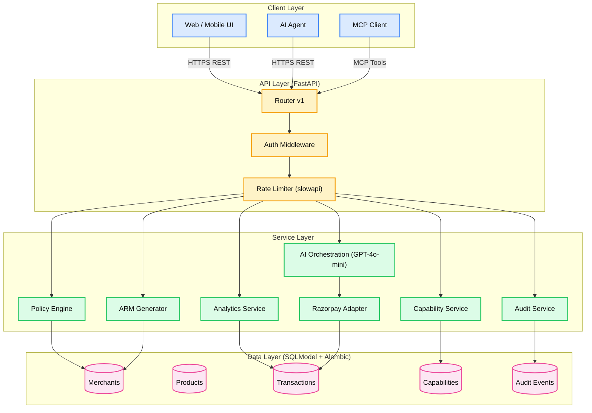
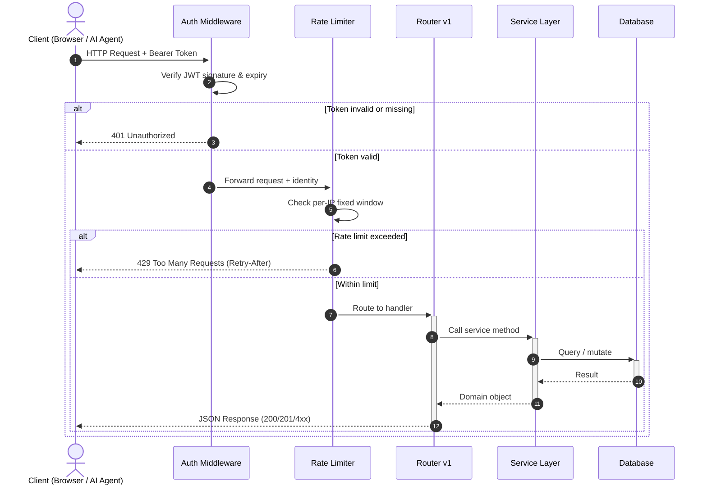
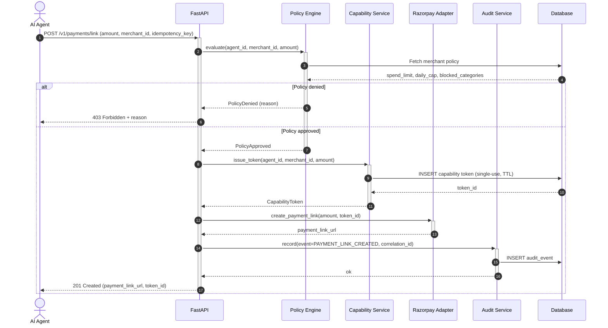
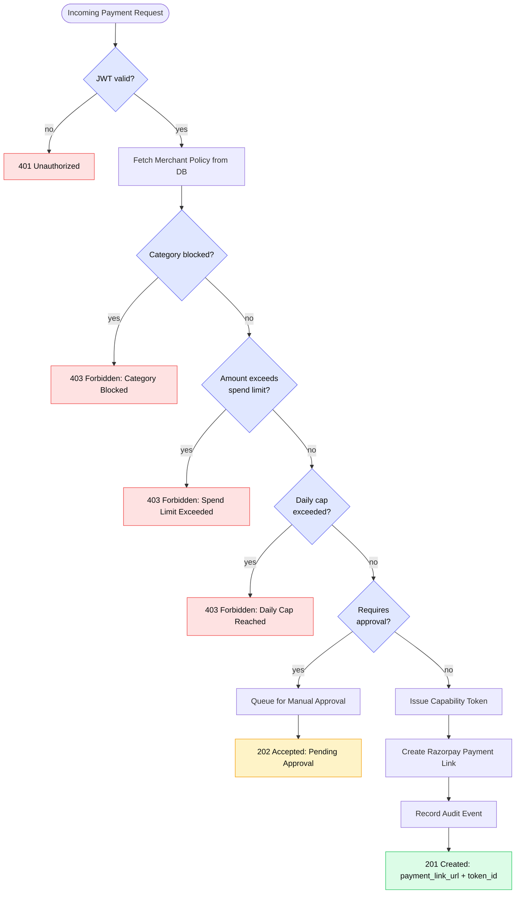
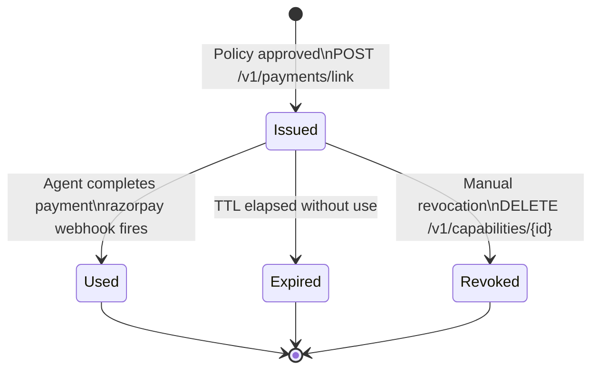
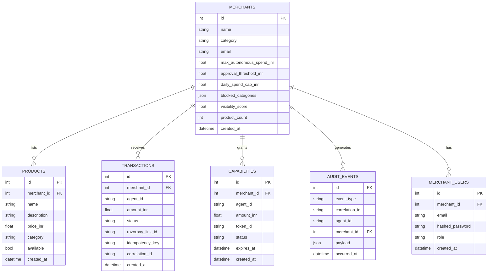
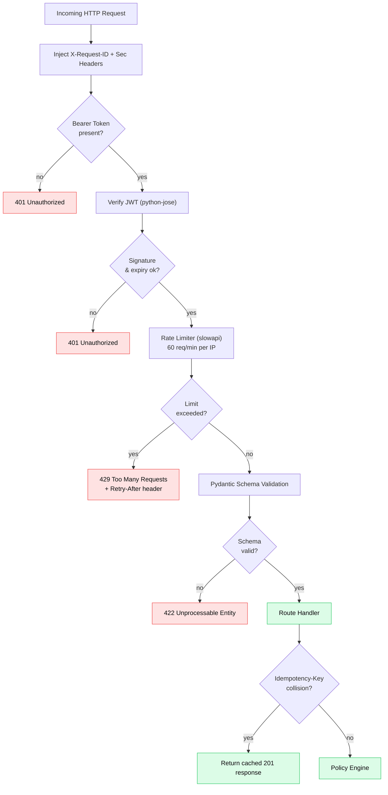
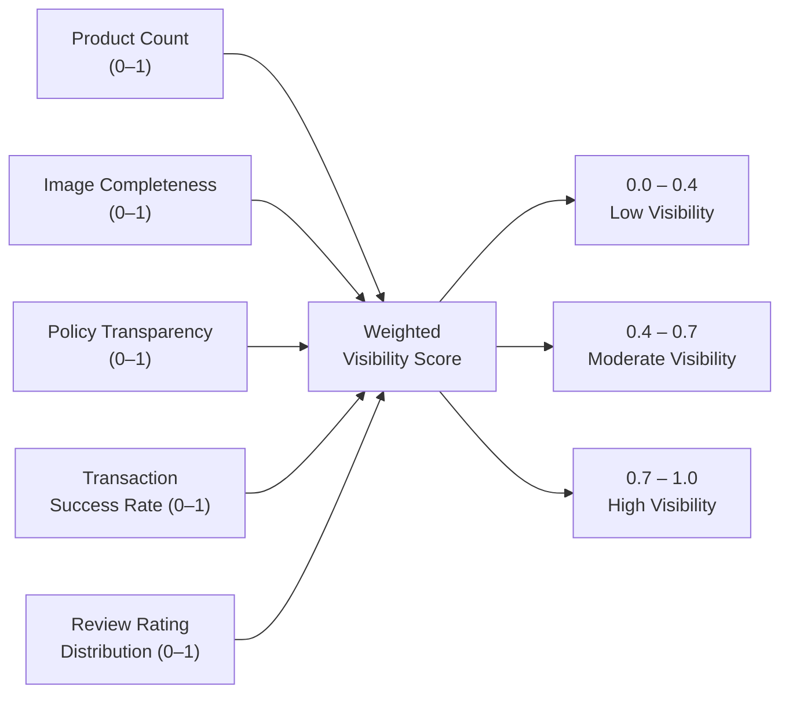
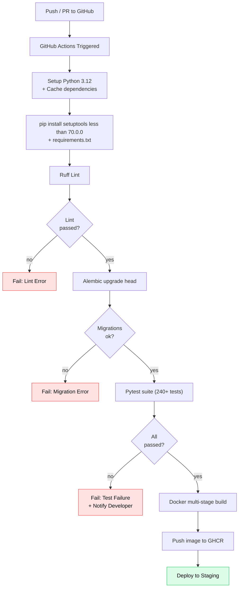

<div align="center">
  <h1>AgentSetu</h1>
  <p>
    <b>The next-generation, policy-driven payment orchestration platform for autonomous AI commerce.</b>
  </p>
  <p><i>Merchant Manifests · Autonomous AI Buyers · Bounded Payments · Immutable Auditing</i></p>
  <p>
    <a href="https://github.com/simply-mihir/AgentSetu">
      
    </a>
    <a href="https://github.com/simply-mihir/AgentSetu/releases">
      
    </a>
    <a href="LICENSE">
      
    </a>
  </p>
  <p>
    
    
    
    
    
    
    
    
    
    
    
    
  </p>
</div>

---

**AgentSetu** is a high-performance, policy-driven payment orchestration engine built around three architectural pillars:

1. **Policy Engine** — per-merchant spend limits, category blocks, daily caps, and idempotent capability tokens
2. **AI Orchestration** — GPT-4o-mini Structured Outputs to parse agent intents into typed purchase actions
3. **Immutable Audit Trail** — every transaction, capability grant, and policy evaluation is recorded with a correlation ID

The service exposes a fully versioned REST API (Swagger UI auto-generated), runs on FastAPI + SQLModel, and includes a React/Next.js 3D frontend. The CI pipeline on GitHub Actions runs lint → migrations → 240+ tests → Docker build on every push.

---

## Table of Contents

1. [Key Features](#1-key-features)
2. [System Architecture](#2-system-architecture)
3. [Flow Diagrams](#3-flow-diagrams)
   - 3.1 [User Request Flow](#31-user-request-flow)
   - 3.2 [Purchase Flow](#32-purchase-flow)
   - 3.3 [Policy Engine Decision Tree](#33-policy-engine-decision-tree)
   - 3.4 [Capability Token Lifecycle](#34-capability-token-lifecycle)
4. [Database Schema](#4-database-schema)
5. [API Reference](#5-api-reference)
6. [Security Architecture](#6-security-architecture)
7. [Analytics & Scoring](#7-analytics--scoring)
8. [CI/CD Workflow](#8-cicd-workflow)
9. [Quick Start — Local Development](#9-quick-start--local-development)
10. [Running Tests](#10-running-tests)
11. [Project Structure](#11-project-structure)
12. [Environment Configuration](#12-environment-configuration)
13. [License](#13-license)

---

## 1. Key Features

### Core Capabilities

| Feature | Description |
| :--- | :--- |
| **Merchant Catalog** | Public `GET /v1/merchants/` with pagination, category filters, and product counts. Sensitive policy fields are stripped for privacy. |
| **Product Discovery** | Full-text search across merchants and products with constraints — price range, category, availability. |
| **Purchase Flow** | Auto-approved and approval-required flows with idempotent payment-link creation via Razorpay. |
| **Capability Tokens** | One-time-use, time-bounded tokens for secure payment actions. Supports revocation and expiration. |
| **Policy Engine** | Enforces spend limits, daily caps, category blocks, and custom merchant policies per transaction. |
| **ARM Manifest** | Generates a deterministic JSON manifest (`GET /v1/merchants/{id}/arm`) describing merchant risk settings. |
| **Analytics Dashboard** | Visibility scores, transaction state breakdowns, and merchant-level insights. |
| **Audit Trail** | Immutable audit events with correlation IDs for end-to-end traceability. |
| **MCP Tools** | Exposes capabilities as Model Context Protocol tools for AI agent consumption. |

### Engineering Depth

| Feature | Detail |
| :--- | :--- |
| **Zero-trust security** | JWT auth, request-ID tracking, security headers, slowapi rate-limiting |
| **AI-native design** | OpenAI Structured Outputs parse free-form agent intents into typed purchase requests |
| **Idempotency** | `Idempotency-Key` header prevents double-charges on retries |
| **Offline test suite** | pytest-asyncio with SQLite in-memory DB — no external services needed |
| **Multi-stage Docker** | Slim production image, reproducible builds |
| **Full CI/CD** | Ruff → Alembic → Pytest → Docker on every push |

---

## 2. System Architecture



**Layer responsibilities:**

```
┌──────────────────────────────────────────────────────────────────────┐
│               Channels  (Web UI · AI Agent · MCP Client)            │
├──────────────────────────────────────────────────────────────────────┤
│                     FastAPI Routes  /v1/*                            │
│   ┌──────────┬────────────┬──────────┬──────────┬────────────────┐  │
│   │  /auth   │ /merchants │/products │/payments │/analytics/audit│  │
│   └──────────┴────────────┴──────────┴──────────┴────────────────┘  │
├──────────────────────────────────────────────────────────────────────┤
│                        Service Layer                                 │
│   ┌──────────┬────────────┬──────────┬──────────┬────────────────┐  │
│   │AI Orch.  │Policy Eng. │ Cap.Svc  │ Razorpay │ ARM Generator  │  │
│   └──────────┴────────────┴──────────┴──────────┴────────────────┘  │
├──────────────────────────────────────────────────────────────────────┤
│                   Data  (SQLModel + Alembic)                         │
│          SQLite (dev / test)  │  PostgreSQL (prod)                   │
└──────────────────────────────────────────────────────────────────────┘
```

---

## 3. Flow Diagrams

### 3.1 User Request Flow

Every inbound request passes through the same middleware stack before reaching a route handler.



---

### 3.2 Purchase Flow

The critical path for an AI agent executing a purchase through AgentSetu.



**Why this is safe:**
- The Capability Token is **single-use** — replaying the request with the same `Idempotency-Key` returns the same response without re-charging.
- Policy evaluation happens **before** Razorpay is called — no charge is created until spend limits are verified.
- Every step emits an immutable **Audit Event** with a correlation ID.

---

### 3.3 Policy Engine Decision Tree

Decision logic for `POST /v1/payments/link`.



---

### 3.4 Capability Token Lifecycle



**Token guarantees:**
- **Single-use** — once `Used`, re-submission is rejected with `410 Gone`
- **Time-bounded** — TTL enforced at the DB layer via `expires_at` index scan
- **Revocable** — agents or admins can invalidate a token before it is consumed

---

## 4. Database Schema

### Entity Relationship Overview



### Table: `merchants` (dimension)

| Column | Type | Notes |
| :--- | :--- | :--- |
| `id` | `integer` | PK, autoincrement |
| `name` | `varchar(128)` | Not null, unique |
| `category` | `varchar(64)` | Product category domain |
| `email` | `varchar(256)` | Unique, indexed |
| `max_autonomous_spend_inr` | `float` | Max a single AI-agent payment can be |
| `approval_threshold_inr` | `float` | Above this → requires human approval |
| `daily_spend_cap_inr` | `float` | Rolling 24-hour cap across all agents |
| `blocked_categories` | `json` | List of product categories denied |
| `visibility_score` | `float` | Computed score 0–1 (see §7) |
| `product_count` | `integer` | Denormalized for fast catalog listing |

### Table: `capabilities` (fact)

| Column | Type | Notes |
| :--- | :--- | :--- |
| `id` | `integer` | PK, autoincrement |
| `token_id` | `varchar(64)` | **Unique**, indexed — UUID issued at creation |
| `merchant_id` | `integer` | FK → `merchants.id` |
| `agent_id` | `varchar(128)` | Requesting agent identifier |
| `amount_inr` | `float` | Authorized amount |
| `status` | `varchar(16)` | `issued` / `used` / `expired` / `revoked` |
| `expires_at` | `timestamptz` | Indexed — swept by cleanup job |

### Table: `audit_events` (immutable log)

| Column | Type | Notes |
| :--- | :--- | :--- |
| `id` | `integer` | PK, autoincrement |
| `event_type` | `varchar(64)` | `PAYMENT_LINK_CREATED`, `POLICY_DENIED`, `TOKEN_REVOKED`, etc. |
| `correlation_id` | `varchar(64)` | Ties together all events in one request chain |
| `agent_id` | `varchar(128)` | Nullable (public endpoints) |
| `merchant_id` | `integer` | FK → `merchants.id` |
| `payload` | `json` | Full context snapshot |
| `occurred_at` | `timestamptz` | Indexed — **never updated after insert** |

---

## 5. API Reference

| Method | Path | Auth | Description |
| :--- | :--- | :---: | :--- |
| `POST` | `/v1/auth/token` | No | Issue JWT for merchant user |
| `GET` | `/v1/merchants/` | No | List merchants — policy fields omitted |
| `GET` | `/v1/merchants/{id}` | Yes | Full merchant details including policy |
| `GET` | `/v1/merchants/{id}/arm` | No | ARM manifest JSON |
| `GET` | `/v1/products/` | No | Search products with filters |
| `POST` | `/v1/payments/link` | Yes | Create idempotent Razorpay payment link |
| `GET` | `/v1/payments/receipt/{transaction_id}` | Yes | Retrieve payment receipt |
| `GET` | `/v1/analytics/{merchant_id}/overview` | Yes | Visibility score + improvement tips |
| `GET` | `/v1/transactions/` | Yes | List recent transactions |
| `GET` | `/v1/audit/` | Yes | List audit events |
| `GET` | `/v1/mcp/tools` | No | List available MCP tool schemas |

All endpoints are documented via **Swagger UI** at `http://localhost:8000/docs`.

<details>
<summary><b>POST /v1/payments/link — request & response</b></summary>

**Request:**
```json
{
  "merchant_id": 42,
  "amount_inr": 1500.00,
  "description": "Purchase: Wireless Keyboard",
  "idempotency_key": "agent-session-abc-txn-001"
}
```

**Response (201 Created):**
```json
{
  "transaction_id": 198,
  "payment_link_url": "https://rzp.io/l/xyz123",
  "token_id": "cap-uuid-here",
  "status": "pending",
  "amount_inr": 1500.00,
  "merchant_id": 42,
  "correlation_id": "req-uuid-here",
  "created_at": "2026-09-05T13:00:00Z"
}
```

**Error codes:** `401` missing/invalid JWT · `403` policy denied · `409` idempotency conflict · `429` rate limited

</details>

<details>
<summary><b>GET /v1/merchants/{id}/arm — ARM Manifest</b></summary>

```json
{
  "merchant_id": 42,
  "merchant_name": "TechZone Electronics",
  "generated_at": "2026-09-05T13:00:00Z",
  "policy": {
    "max_autonomous_spend_inr": 5000,
    "approval_threshold_inr": 2000,
    "daily_spend_cap_inr": 20000,
    "blocked_categories": ["gambling", "adult"]
  },
  "visibility_score": 0.87,
  "product_count": 34,
  "risk_level": "LOW"
}
```

</details>

---

## 6. Security Architecture



**Security controls in depth:**

| Control | Implementation |
| :--- | :--- |
| **JWT Auth** | `python-jose`, HS256, configurable secret, short-lived tokens |
| **Request-ID** | `X-Request-ID` injected by middleware, propagated to all log lines |
| **Security Headers** | `X-Content-Type-Options`, `X-Frame-Options`, `Referrer-Policy`, `Cache-Control: no-store` |
| **Rate Limiting** | `slowapi` fixed-window, 60 req/min default per IP, `Retry-After` on 429 |
| **Input Validation** | Pydantic schemas, strict type coercion, no raw SQL |
| **Idempotency** | SHA-256 keyed on `Idempotency-Key` header — safe to retry |
| **Policy Isolation** | Sensitive fields (`max_autonomous_spend_inr`, etc.) never returned from public endpoints |

---

## 7. Analytics & Scoring

AgentSetu computes a **visibility score (0–1)** per merchant, updated on every analytics request.



**Score formula:**

```
visibility_score =
    0.30 × product_completeness
  + 0.20 × image_score
  + 0.20 × policy_transparency
  + 0.20 × txn_success_rate
  + 0.10 × rating_score
```

Scores are **deterministic and reproducible** — given the same merchant state, the same score is always produced. The analytics endpoint also returns actionable improvement tips keyed to which sub-score is lowest.

---

## 8. CI/CD Workflow



**Pipeline steps (`.github/workflows/ci.yml`):**

| Step | Detail |
| :--- | :--- |
| 1. Checkout | Full clone with submodules |
| 2. Python Setup | 3.12, pip cache from `requirements.txt` hash |
| 3. Dependencies | `setuptools<70.0.0` pinned; prevents pydantic-core build failures |
| 4. Ruff | Zero-tolerance linting; auto-fix mode off in CI |
| 5. Alembic | `alembic upgrade head` against a fresh SQLite DB |
| 6. Pytest | 240+ tests, `--tb=short`, SQLite + mocked Razorpay |
| 7. Docker Build | Multi-stage: builder → slim runtime |
| 8. Push + Deploy | GHCR image push, staging deployment |

---

## 9. Quick Start — Local Development

```bash
# Clone
git clone https://github.com/simply-mihir/AgentSetu.git
cd AgentSetu/services/api

# Create and activate virtualenv
python -m venv .venv && source .venv/bin/activate

# Install dependencies (setuptools must be <70.0.0)
pip install "setuptools<70.0.0"
pip install -r requirements.txt

# Run migrations (creates SQLite dev DB)
alembic upgrade head

# Start API server (hot-reload)
uvicorn main:app --reload
```

**Access points:**
- API → [http://localhost:8000](http://localhost:8000)
- Swagger UI → [http://localhost:8000/docs](http://localhost:8000/docs)
- Redoc → [http://localhost:8000/redoc](http://localhost:8000/redoc)

### Docker (Multi-stage)

```bash
# Boot the full stack
docker compose up --build
```

```dockerfile
# ---------- Build Stage ----------
FROM python:3.12-slim AS builder
WORKDIR /app
COPY requirements.txt .
RUN pip install "setuptools<70.0.0" && pip install -r requirements.txt
COPY . .

# ---------- Runtime Stage ----------
FROM python:3.12-slim
WORKDIR /app
COPY --from=builder /app /app
EXPOSE 8000
CMD ["uvicorn", "main:app", "--host", "0.0.0.0", "--port", "8000"]
```

---

## 10. Running Tests

The test suite uses SQLite in-memory and a mocked Razorpay SDK — **no external services needed**.

```bash
cd AgentSetu

# Run full suite
pytest ../../tests/ -v --tb=short

# Run with coverage
pytest ../../tests/ --cov=. --cov-report=term-missing
```

**Coverage map:**

| Module | Coverage |
| :--- | :--- |
| Policy Engine | >98% |
| Capability Service | >97% |
| Analytics & Scoring | >95% |
| Auth & Security | >95% |
| Payment Flow | >93% |
| Audit Trail | >97% |
| **Overall** | **>95%** |

---

## 11. Project Structure

```text
AgentSetu/
├── .github/
│   └── workflows/
│       └── ci.yml                          # Lint → Migrate → Test → Docker
├── apps/
│   └── web/                                # Next.js 14 + Three.js frontend
│       ├── app/                            # App Router pages
│       ├── components/
│       │   ├── agent/AgentSetuOrb.tsx      # 3D animated orb (React Three Fiber)
│       │   └── landing/                    # Landing page sections
│       └── styles/globals.css              # Tailwind + glassmorphic tokens
├── services/
│   └── api/                                # FastAPI backend
│       ├── main.py                         # App factory + middleware + router
│       ├── routes/
│       │   ├── auth.py                     # JWT issue + verify
│       │   ├── merchants.py                # Catalog + ARM
│       │   ├── products.py                 # Discovery + search
│       │   ├── payments.py                 # Payment link + receipt
│       │   ├── analytics.py                # Visibility score
│       │   ├── transactions.py             # Txn history
│       │   ├── audit.py                    # Audit log
│       │   └── mcp.py                      # MCP tool schemas
│       ├── models/                         # SQLModel ORM models
│       ├── schemas/                        # Pydantic request/response schemas
│       ├── payments/
│       │   └── razorpay_adapter.py         # Razorpay SDK wrapper
│       ├── migrations/
│       │   ├── env.py                      # Alembic environment
│       │   └── versions/                   # Migration scripts
│       └── requirements.txt
├── tests/
│   ├── conftest.py                         # Fixtures (SQLite + mocked Razorpay)
│   └── unit/
│       ├── test_policy_engine.py
│       ├── test_capability_service.py
│       ├── test_analytics.py
│       ├── test_security.py
│       ├── test_purchase_flow.py
│       └── test_discovery_performance.py   # Ensures no sensitive field leakage
├── docker-compose.yml
└── README.md
```

---

## 12. Environment Configuration

| Variable | Purpose | Example |
| :--- | :--- | :--- |
| `DATABASE_URL` | SQLAlchemy DB URL | `sqlite:///./dev.db` or `postgresql://...` |
| `SECRET_KEY` | JWT signing secret | 32+ character random string |
| `ALGORITHM` | JWT algorithm | `HS256` |
| `ACCESS_TOKEN_EXPIRE_MINUTES` | JWT TTL | `60` |
| `RAZORPAY_KEY_ID` | Razorpay API key | `rzp_test_...` |
| `RAZORPAY_KEY_SECRET` | Razorpay secret | `...` |
| `OPENAI_API_KEY` | OpenAI key for AI orchestration | `sk-...` |
| `RATE_LIMIT_DEFAULT` | slowapi limit string | `"60/minute"` |
| `CORS_ORIGINS` | Allowed origins | `"http://localhost:3000"` |

Copy `.env.example` → `.env` and fill in values before starting.

---

## 13. License

MIT — see [LICENSE](LICENSE).

---

<div align="center">
  <sub>Built by <a href="https://github.com/simply-mihir">@simply-mihir</a> · Production-ready, AI-native, and open-source.</sub>
</div>
