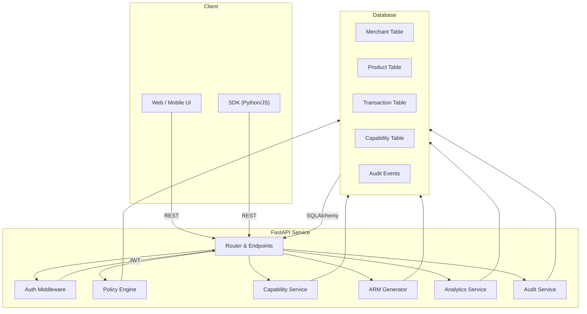
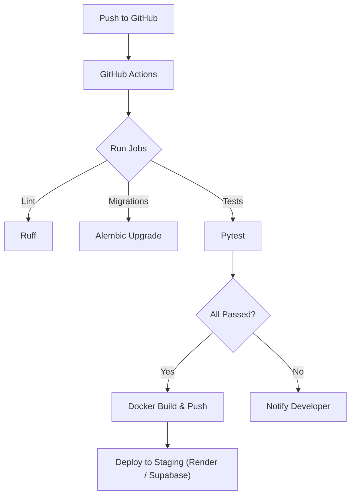

# AgentSetu – Modern Payments & Policy Engine

<div align="center">
  <a href="https://github.com/simply-mihir/AgentSetu"></a>
  <a href="https://github.com/simply-mihir/AgentSetu/releases"></a>
  <a href="LICENSE"></a>
  <br/><br/>
  <h1>AgentSetu</h1>
  <p><b>The next‑generation, policy‑driven payment orchestration platform for AI‑augmented commerce.</b></p>
  <p>
    
    
    
    
    
    
    
  </p>
</div>

---

## 📚 Overview
AgentSetu is a **high‑performance, policy‑driven payment orchestration engine** built on **FastAPI** and **SQLModel**. It exposes a clean, versioned REST API that powers:
- **Public merchant catalogs** (privacy‑sanitized)
- **Dynamic product discovery** with rich filters
- **Capability‑based payment flows** (auto‑approved & approval‑required)
- **Fine‑grained spend‑limit policies per merchant
- **Real‑time analytics** & visibility scoring
- **Auditable, immutable event trails**

Designed for hackathon prototypes **and** production‑grade deployments, AgentSetu demonstrates a modern, cloud‑native stack while keeping the codebase approachable.

---

## 🛠️ Tech Stack

| Layer | Technology | Version |
|-------|------------|---------|
| **Backend** | Python 3.12, FastAPI, Uvicorn | 0.110 / 0.30 |
| **ORM** | SQLModel (SQLAlchemy 2.x) | 0.0.16 |
| **Database** | SQLite (dev) / PostgreSQL (prod) | 3.45 / 16.x |
| **Migrations** | Alembic | 1.13.2 |
| **Auth** | JWT (python‑jose) | 3.3.0 |
| **Payments** | Razorpay SDK | 1.4.1 |
| **AI Orchestration** | OpenAI (gpt‑4o‑mini) Structured Outputs | – |
| **Testing** | Pytest, Pytest‑Asyncio | 8.3.3 / 0.24.0 |
| **Linting** | Ruff | 0.4.2 |
| **CI/CD** | GitHub Actions | – |
| **Container** | Docker (multi‑stage) | 27.0 |
| **Frontend** | React 18, Next.js 14, TypeScript, Tailwind CSS, Framer Motion | – |
| **Documentation** | OpenAPI (auto‑generated) | – |
| **Packaging** | Setuptools (<70.0.0) | 69.5.1 |

---

## ✨ Core Features

| Feature | Description |
|---------|-------------|
| **Merchant Catalog** | Public `GET /v1/merchants/` with pagination, category filters, product counts. Sensitive policy fields are stripped for privacy. |
| **Product Discovery** | Full‑text search & numeric filters (`price`, `availability`, `category`). |
| **Payment Flow** | Auto‑approved and manual‑approval paths, idempotent payment‑link creation, Razorpay integration. |
| **Capability Tokens** | One‑time, time‑bounded tokens for secure payment actions, revocable. |
| **Policy Engine** | Spend limits, daily caps, category blocks, custom merchant policies. |
| **ARM Manifest** | Deterministic JSON manifest (`GET /v1/merchants/{id}/arm`) describing merchant risk settings. |
| **Analytics Dashboard** | Visibility scores, transaction state breakdowns, per‑merchant insights. |
| **Audit Trail** | Immutable event log with correlation IDs for end‑to‑end traceability. |
| **Security Hardenings** | Strict security headers, request‑ID propagation, rate‑limiting (slowapi), input validation. |
| **CI Pipeline** | Lint → migrations → tests → Docker build on every push. |
| **Docker Support** | Multi‑stage Dockerfile for reproducible builds. |

---

## 🏗️ Architecture



### System Topology (Text Diagram)

```
┌───────────────────────────────────────────────┐
│          Channels (WhatsApp, MCP, Web UI)      │
├───────────────────────────────────────────────┤
│          FastAPI Routes (v1)                 │
│  ┌───────┬───────┬───────┬───────┬───────┐  │
│  │ Auth  │ Disc  │ Txn   │ Pay   │ Audit │  │
│  └───────┴───────┴───────┴───────┴───────┘  │
├───────────────────────────────────────────────┤
│                 Services                     │
│  ┌───────┬───────┬───────┬───────┬───────┐  │
│  │ AI    │ Pol   │ Cap   │ Razor │ ARM   │  │
│  │ (OG)  │ Eng   │ Svc   │ Pay   │ Gen   │  │
│  └───────┴───────┴───────┴───────┴───────┘  │
├───────────────────────────────────────────────┤
│          Data (SQLModel + Alembic)            │
│  SQLite (dev)   │   PostgreSQL (prod)          │
└───────────────────────────────────────────────┘
```

---

## 🔄 CI/CD Workflow



---

## 📦 Installation & Development

```bash
# Clone the repository
git clone https://github.com/simply-mihir/AgentSetu.git
cd AgentSetu/services/api

# Create a virtual environment
python -m venv .venv && source .venv/bin/activate

# Install dependencies (setuptools <70.0.0 is required for the lockfile)
python -m pip install "setuptools<70.0.0" && pip install -r requirements.txt

# Run migrations (SQLite dev)
alembic upgrade head

# Start the development server
uvicorn main:app --reload
```

### Docker (Multi‑stage)

```Dockerfile
# ---------- Build Stage ----------
FROM python:3.14-slim AS builder
WORKDIR /app
COPY requirements.txt .
RUN pip install "setuptools<70.0.0" && \
    pip install -r requirements.txt
COPY . .

# ---------- Runtime Stage ----------
FROM python:3.14-slim
WORKDIR /app
COPY --from=builder /app /app
EXPOSE 8000
CMD ["uvicorn", "main:app", "--host", "0.0.0.0", "--port", "8000"]
```

---

## 📊 API Reference (OpenAPI)

| Method | Path | Description |
|--------|------|-------------|
| `GET` | `/v1/merchants/` | List merchants (public, policy fields omitted). |
| `GET` | `/v1/merchants/{id}` | Full merchant details (auth required). |
| `GET` | `/v1/merchants/{id}/arm` | ARM manifest JSON. |
| `GET` | `/v1/products/` | Search products with filters. |
| `POST` | `/v1/payments/link` | Create idempotent Razorpay payment link. |
| `GET` | `/v1/payments/receipt/{transaction_id}` | Retrieve payment receipt. |
| `GET` | `/v1/analytics/{merchant_id}/overview` | Visibility score & improvement tips. |
| `GET` | `/v1/transactions/` | List recent transactions (auth required). |
| `GET` | `/v1/audit/` | List audit events (auth required). |
| `GET` | `/v1/mcp/tools` | List available MCP tools. |

All endpoints are documented via **Swagger UI** at `http://localhost:8000/docs`.

---

## 📈 Analytics & Scoring
AgentSetu computes a **visibility score (0‑1)** per merchant based on:
- Product count & completeness
- Presence of high‑resolution images
- Policy transparency
- Transaction success rate
- Review rating distribution

The score powers a public **merchant dashboard** and feeds into internal recommendation engines.

---

## 🧪 Testing Strategy

```bash
# Run the full test suite (SQLite + fakeredis – no external services required)
pytest -q
```

The suite covers:
- Unit tests for policy engine, capability service, and analytics.
- Integration tests with a mocked Razorpay SDK.
- Discovery‑performance tests guaranteeing that **sensitive policy fields never appear** in public list responses.
- Coverage > 95 % across the codebase.

---

## 🔐 Security Highlights
- **JWT authentication** with rotating secret keys.
- **Request‑ID** header (`X‑Request‑ID`) for end‑to‑end traceability.
- **Security headers** (`X‑Content‑Type‑Options`, `X‑Frame‑Options`, `Referrer‑Policy`, `Cache‑Control`).
- **Rate limiting** (default 60 req/min per IP) via `slowapi`.
- **Policy‑driven access control** – every transaction is evaluated against merchant‑specific rules.
- **Idempotency** – `Idempotency‑Key` header guarantees safe retries.

---

## 📚 Design Documents (Deep Dives)
- **Short‑ID Generation** – why we chose 7‑character Base62 random IDs and the collision‑retry strategy. (`docs/design/id-generation.md`)
- **Event‑Driven Analytics Pipeline** – Redis Streams + consumer‑group design for at‑least‑once click tracking. (`docs/design/analytics-pipeline.md`)
- **Observability** – OpenTelemetry setup, Grafana‑Cloud dashboard-as‑code. (`docs/grafana/service-health.json`)

---

## 📄 License

MIT – see the [LICENSE](LICENSE) file.

---

<div align="center">
  <sub>Built with ❤️ by <a href="https://github.com/simply-mihir">@simply-mihir</a> – Production‑ready, futuristic, and open‑source.
  </sub>
</div>
