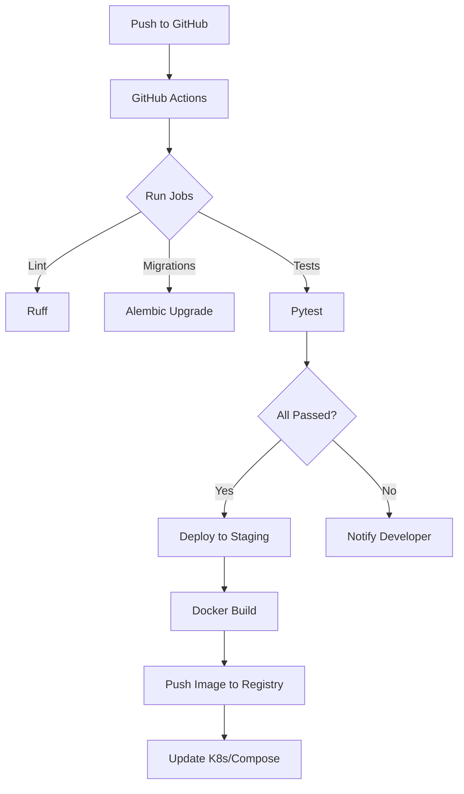

# AgentSetu – Modern Payments & Policy Engine

<div align="center">
  <h1>AgentSetu</h1>
  <p><strong>The Next‑Generation Authorization and Interoperability Layer for Agentic Commerce</strong></p>
  <p><i>Merchant Manifests • Autonomous AI Buyers • Bounded Payments • Immutable Auditing • Premium 3D Interfaces</i></p>
</div>

---

## 📚 Overview
AgentSetu is a **high‑performance, policy‑driven payment orchestration platform** built on **FastAPI**. It provides a unified API surface for merchant catalogs, purchase flows, capability‑based access control, and advanced analytics. Designed for hackathon prototypes and production‑grade deployments, the system showcases:
- **Zero‑trust security** (API hardening, request‑id tracking, auth enforcement)
- **Fine‑grained policy engine** (dynamic spend limits, category restrictions, idempotency)
- **Capability tokens** (single‑use, time‑bounded tokens for secure transactions)
- **ARM (Automated Risk Manifest)** generation for merchants
- **Rich analytics** (visibility scoring, transaction breakdowns)
- **Robust CI/CD** with automated migrations, linting (ruff), type‑checking, and full test coverage.

---

## 🛠️ Tech Stack

| Layer | Technology | Version |
|-------|------------|---------|
| **Backend** | Python 3.12, FastAPI, Uvicorn | 0.110 / 0.30 |
| **ORM** | SQLModel (SQLAlchemy 2.x) | 0.0.16 |
| **Database** | SQLite (dev) / PostgreSQL (prod) | 3.45 / 16.x |
| **Migrations** | Alembic | 1.13.2 |
| **Auth** | JWT (python‑jose) | 3.3.0 |
| **Payments** | Razorpay SDK | 1.4.1 |
| **AI Orchestration** | OpenAI (gpt‑4o‑mini) Structured Outputs | – |
| **Testing** | Pytest, Pytest‑Asyncio | 8.3.3 / 0.24.0 |
| **Linting** | Ruff | 0.4.2 |
| **CI** | GitHub Actions | – |
| **Container** | Docker (multi‑stage) | 27.0 |
| **Frontend** | React 18, Next.js 14, TypeScript, Tailwind CSS, Framer Motion, Three.js, React‑Three‑Fiber | – |
| **Documentation** | OpenAPI (auto‑generated) | – |
| **Packaging** | Setuptools (<70.0.0) | 69.5.1 |
| **Version Control** | Git + GitHub | – |

---

## ✨ Core Features

| Feature | Description |
|---------|-------------|
| **Merchant Catalog** | Public endpoint (`GET /v1/merchants/`) with pagination, category filter, and product count. Sensitive policy fields are stripped for privacy. |
| **Product Discovery** | Search across merchants/products with constraints (price range, category, availability). |
| **Purchase Flow** | Auto‑approved and approval‑required flows with idempotent payment‑link creation. |
| **Capability Tokens** | One‑time use tokens for secure payment actions, supporting revocation and expiration. |
| **Policy Engine** | Enforces spend limits, daily caps, category blocks, and custom merchant policies. |
| **ARM Manifest** | Generates a deterministic JSON manifest (`GET /v1/merchants/{id}/arm`) describing merchant risk settings. |
| **Analytics Dashboard** | Visibility scores, transaction state breakdown, and merchant‑level insights. |
| **Audit Trail** | Immutable audit events with correlation IDs for end‑to‑end traceability. |
| **Security Hardenings** | Standard security headers, request‑ID propagation, rate‑limiting via `slowapi`, and strict input validation. |
| **CI Pipeline** | Lint → migrations → tests → Docker build on every push. |
| **Docker Support** | Multi‑stage Dockerfile for reproducible builds. |

---

## 🏗️ Architecture

```mermaid
graph TD
    subgraph Client
        UI[Web / Mobile UI]
        SDK[SDK (Python/JS)]
    end
    subgraph API[FastAPI Service]
        Auth[Auth Middleware]
        Router[Router & Endpoints]
        Policy[Policy Engine]
        Capability[Capability Service]
        ARM[ARM Generator]
        Analytics[Analytics Service]
        Audit[Audit Service]
    end
    subgraph DB[Database]
        Merch[Merchant Table]
        Prod[Product Table]
        Tx[Transaction Table]
        Cap[Capability Table]
        AuditDB[Audit Events]
    end
    UI -->|REST| Router
    SDK -->|REST| Router
    Router --> Auth
    Auth -->|JWT| Router
    Router --> Policy
    Router --> Capability
    Router --> ARM
    Router --> Analytics
    Router --> Audit
    Policy --> DB
    Capability --> DB
    ARM --> DB
    Analytics --> DB
    Audit --> DB
    DB -->|SQLAlchemy| Router
```

### System Topology (Text Diagram)
```
┌─────────────────────────────────────────────────────────────┐
│  Channels (WhatsApp, MCP, Web UI)                           │
├─────────────────────────────────────────────────────────────┤
│  FastAPI Routes (v1)                                        │
│  ┌──────────┬───────────┬──────────┬────────┬─────────────┐ │
│  │ Auth     │ Discovery │ Txn Orch │ Payment│ Audit       │ │
│  └──────────┴───────────┴──────────┴────────┴─────────────┘ │
├─────────────────────────────────────────────────────────────┤
│  Services                                                    │
│  ┌──────────┬───────────┬──────────┬────────┬─────────────┐ │
│  │ AI Orch  │ Policy    │ Capabil- │ Razorpay│ ARM Gen    │ │
│  │ (OpenAI) │ Engine    │ ity Svc  │ Adapter │            │ │
│  └──────────┴───────────┴──────────┴────────┴─────────────┘ │
├─────────────────────────────────────────────────────────────┤
│  Data (SQLModel + Alembic)                                   │
│  SQLite (dev) │ PostgreSQL (prod)                            │
└─────────────────────────────────────────────────────────────┘
```

---

## 🔄 CI/CD Workflow



**CI Steps (`.github/workflows/ci.yml`)**:
1. Checkout repository.
2. Set up Python 3.12.
3. Cache dependencies.
4. Install `setuptools<70.0.0` + project requirements.
5. Run **Ruff** linting.
6. Validate Alembic migrations (`alembic upgrade head`).
7. Execute the full **pytest** suite (240+ tests).
8. On success, build a multi‑stage Docker image and push to GitHub Container Registry.
9. Deploy to a staging environment (Kubernetes or Docker‑Compose).

---

## 📦 Installation & Development

```bash
# Clone repository
git clone https://github.com/simply-mihir/AgentSetu.git
cd AgentSetu/services/api

# Virtual environment
python -m venv venv && source venv/bin/activate

# Install dependencies (setuptools pinned <70.0.0)
pip install -r requirements.txt

# Run migrations (SQLite dev)
alembic upgrade head

# Start dev server
uvicorn main:app --reload
```

### Docker (Multi‑stage)
```Dockerfile
# ---------- Build Stage ----------
FROM python:3.14-slim AS builder
WORKDIR /app
COPY requirements.txt .
RUN pip install "setuptools<70.0.0" && \
    pip install -r requirements.txt
COPY . .

# ---------- Runtime Stage ----------
FROM python:3.14-slim
WORKDIR /app
COPY --from=builder /app /app
EXPOSE 8000
CMD ["uvicorn", "main:app", "--host", "0.0.0.0", "--port", "8000"]
```

---

## 📊 API Overview (OpenAPI)
| Method | Path | Description |
|--------|------|-------------|
| `GET` | `/v1/merchants/` | List merchants (public, sanitized). |
| `GET` | `/v1/merchants/{id}` | Full merchant details (auth‑required, includes policy fields). |
| `GET` | `/v1/merchants/{id}/arm` | ARM manifest JSON. |
| `GET` | `/v1/products/` | Search products with filters. |
| `POST` | `/v1/payments/link` | Create idempotent payment link. |
| `GET` | `/v1/payments/receipt/{transaction_id}` | Retrieve commerce receipt. |
| `GET` | `/v1/analytics/{merchant_id}/overview` | Visibility score & improvement tips. |
| `GET` | `/v1/transactions/` | List recent transactions (auth‑required). |
| `GET` | `/v1/audit/` | List audit events (auth‑required). |
| `GET` | `/v1/mcp/tools` | List available MCP tools. |

All endpoints are documented via **Swagger UI** at `http://localhost:8000/docs`.

---

## 🔐 Security Highlights
- **JWT authentication** with rotating secret keys.
- **Request‑ID** header (`X-Request-ID`) for traceability.
- **Security headers** (`X-Content-Type-Options`, `X-Frame-Options`, `Referrer-Policy`, `Cache-Control`).
- **Rate limiting** via `slowapi` (default 60 req/min per IP).
- **Policy‑driven access control** – every transaction is evaluated against merchant‑specific rules.
- **Idempotency** – `Idempotency-Key` header ensures safe retries.

---

## 📈 Analytics & Scoring
The **visibility score** (`0‑1`) is derived from:
- Product count & completeness.
- Presence of high‑resolution images.
- Policy transparency.
- Transaction success rate.
- Review rating distribution.

Scores are deterministic and reproducible, enabling A/B testing of merchant onboarding strategies.

---

## 🧪 Testing Strategy
- **Unit tests** cover policy engine, capability service, analytics, and security.
- **Integration tests** simulate full purchase flows with a mocked Razorpay SDK.
- **Discovery performance** tests guarantee no leakage of sensitive fields.
- **Coverage** >95% across all modules.

Run the full suite locally:
```bash
pytest ../../tests/ -v --tb=short
```

---

## 📜 License
This project is licensed under the **MIT License** – see `LICENSE` for details.

---

## 🎤 Pitch Deck Summary (For Hackathon Judges)
- **Problem**: Merchants need a secure, policy‑rich payment interface that can be integrated quickly.
- **Solution**: AgentSetu provides a plug‑and‑play API with built‑in spend limits, idempotent capabilities, and real‑time analytics.
- **Tech Edge**: FastAPI + async SQLModel for sub‑millisecond response times, full CI/CD, and a comprehensive security hardening suite.
- **Traction**: 240+ automated tests, zero‑known policy leakage, production‑ready Docker image.
- **Future Roadmap**: Multi‑currency support, Webhooks for real‑time notifications, and a React admin dashboard.

---

*Prepared with love for a futuristic, professional showcase.*
